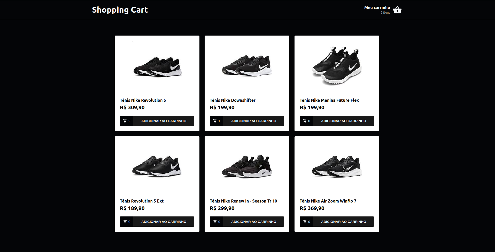

<p align="center">
  <a href="#tec">Tecnologias</a>&nbsp;&nbsp;&nbsp;|&nbsp;&nbsp;&nbsp;
  <a href="#infor">Como usar</a>&nbsp;&nbsp;&nbsp;|&nbsp;&nbsp;&nbsp;
</p>

<p align="center">
  
</p>

## :rocket: Tecnologias

Esse projeto foi desenvolvido com as seguintes tecnologias:

-  [ReactJS](https://reactjs.org/)
-  [React Router v4](https://github.com/ReactTraining/react-router)
-  [Axios](https://github.com/axios/axios)
-  [React-Toastify](https://fkhadra.github.io/react-toastify/)
-  [React-Icons](https://react-icons.netlify.com/)
-  [json-server](https://github.com/typicode/json-server)

## :information_source: Como usar

Para clonar e executar essa aplicação, você precisará do [Git](https://git-scm.com), [Node.js v10.16][nodejs] ou superior + [Yarn v1.13][yarn] ou superior instalado no sua máquina. Execute na linha de comando:

```bash
# Clone esse repositório
$ git clone https://github.com/MarcosRene/shopping-cart

# Vá para a pasta do respositório
$ cd shopping-cart

# Instale as dependências 
$ yarn install

# Execute o app
$ yarn start
```

## :memo: Licença
Este projeto está sobre licença MIT. Consulte [LICENSE](https://github.com/MarcosRene/shopping-cart/blob/master/LICENSE) para mais informações.


[nodejs]: https://nodejs.org/
[yarn]: https://yarnpkg.com/
